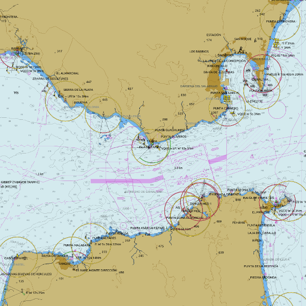

  

Czy są dostępne <a href="https://opencpn.org/OpenCPN/info/chartsource.html"><strong>darmowe mapy </strong></a> dla interesującego cię akwenu?

  

<i class="down"></i>

<i class="down"></i>

  

    

Nie

  

  
  

    

Tak

  

<i class="right"></i>

  
  

    

Gratulacje! Jesteś szczęściarzem. Ściągnij i <a href="https://opencpn.org/wiki/dokuwiki/doku.php?id=opencpn:opencpn_user_manual:getting_started:chart_installation"><strong>zainstaluj</strong></a> swoje mapy.

  

  

<i class="down"></i>

  

Czy są dostępne <a href="https://o-charts.org/shop/index.php?id_category=8&controller=category"><strong>mapy wektorowe oeSENC</strong></a> dla interesującego cię akwenu?

  

<i class="down"></i>

<i class="down"></i>

  

    

Nie

  

  
  

    

Tak

  

<i class="right"></i>

  
  

    

<a href="./oesenc_pl_PL.html"><strong> Kup i zainstaluj wektorowe mapy oeSENC</strong></a>, nie zapominaj o ich uaktualnianiu.

  

  

<i class="down"></i>

  

Czy są dostępne <a href="https://o-charts.org/shop/index.php?id_category=14&controller=category"><strong>rastrowe mapy oeRNC</strong></a>dla interesującego cię akwenu?

  

<i class="down"></i>

<i class="down"></i>

  

    

Nie

  

  
  

    

Tak

  

<i class="right"></i>

  
  

    

<a href="./oernc_pl_PL.html"><strong> Kup i zainstaluj rastrowe mapy oeRNC</strong></a>, nie zapominaj o ich uaktualnianiu.

  

  

<i class="down"></i>

  

Czy są dostępne <a href="https://www.chartworld.com/shop/off_enc"><strong>mapy wektorowe S-63</strong></a> dla interesującego cię akwenu?

  

<i class="down"></i>

<i class="down"></i>

  

    

Nie

  

  
  

    

Tak

  

<i class="right"></i>

  
  

    

<a href="https://o-charts.org/shop/index.php?id_category=6&controller=category"><strong>Kup UserPermit</strong></a>. Następnie <a href="https://www.chartworld.com/shop/off_enc"><strong>kup mapy S-63</strong></a> i <a href="./s63_pl_PL.html"><strong>zainstaluj je</strong></a>.

  

  

<i class="down"></i>

  

Pomóż nam skontaktować się ze służbami Twego kraju, aby dodać spróbować udostępnić te mapy dla OpenCPN.

   

