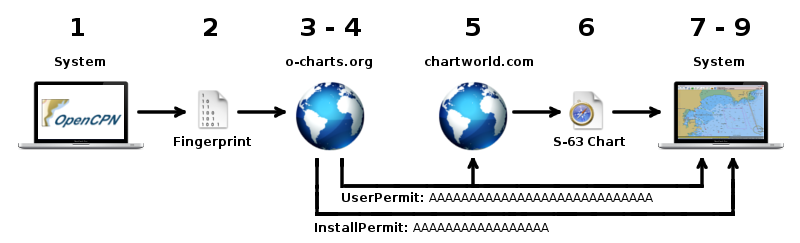

# S-63 UserPermits Villkor för användarlicens

- S-63 plugin är inte tillgänglig för Android eller iOS.

- Vi säljer inte S-63 sjökort utan tillhandahåller en S-63 användarlicens *UserPermit* som behövs för att köpa licensierade kort från en S-63 leverantör som [Chartworld](https://www.chartworld.com/shop/off_enc).

- För att köpa S-63 kort från någon leverantör, behöver du en användarlicens UserPermit. Sjökort som licensierats med OpenCPN S-63 användarlicens, UserPermit, kan bara användas med OpenCPN såsom fastställts i S-63 standarden.

- Du får lov att använda varje köpt set av kort på fem *system* samtidigt eller så kan du spara de som en backup som kan användas i fall ditt huvudsakliga system fallerar. Vi kommer att generera en OpenCPN installationsnyckel *InstallPermit* för varje enskilt system. Installationsnyckeln, InstallPermit, knyter ihop ett kort-set för OpenCPN med ett system. OpenCPN InstallPermit och S-63, cell permit är skilda saker.

- *System* är en kombination av din enhet och använt operativsystem, OS. Om endera eller båda delarna av detta system ändras i grunden är det inte längre samma system och licensen är inte längre giltig utan backupen får användas på ett ersättningssystem.

- Om du har förbrukat din 5 licenser, kommer ni att köpa få en ny användarlicens, UserPermit. och licensiera ny sjökort för denna nya användarlicens. I det fallet kommer fem nya installationsnycklar att skapas.

- Licensen kommer att gälla alla uppdateringar av OpenCPN eller operativsystemet. Ny eller åter-installation av operativsystemet kommer däremot att kräva ny licens.

- När du har licensierat en UserPermit kan den inte återbetalas.

- Efter nedladdning av sjökort till ett system går det inte att flytta licensen till ett annat system.

- Kontrollera S-63 kortens leverantör om villkoren för uppdatering och utgångsdatum.

# Installation av Användarlicens/Installationsnyckel, UserPermits/InstallPermits, och S-63 sjökort

1. *System* är den dator som du tänker använda för OpenCPN. De kort du licensierar från en VAR för detta system kan endast användas där. Ladda hem och installera [S-63 plugin](https://opencpn.org/OpenCPN/plugins/s63.html) (För OpenCPN version 4.6 och högre).
    
2. Öppna OpenCPN, *Användarinställningar → Plugins → S-63* och aktivera den. Öppna OpenCPN, *Användarinställningar→ Sjökort → S63 sjökort → Fliken Nycklar och Tillstånd* och skapa en systemidentifierare (Fingerprint) för ditt system genom att klicka på knappen *Skapa fil med systemidentifierare*. 
        
3. Besök [o-charts shop](https://o-charts.org/shop) och köp en användarlicens UserPermit.
        
4. Gå till [min s-63 UserPermits](https://o-charts.org/shop/index.php?fc=module&module=ocpermits&controller=ocpermits) sida och skapa en InstallPermit genom uppladdning av fingeravtryck-filen som du skapade innan och länka den till ditt s-63 UserPermit.
        
5. Besök butiken hos din VAR (S-63 sjökortsleverantör) och licensiera så många S-63 kort du behöver. Använd din OpenCPN S-63 UserPermit för detta. Om VAR frågar om en ”HW-ID”, så ignorera det.
        
6. Ladda ner och packa upp din uppsättning av S-63 kortfiler. Efteråt skall det finnas en katalog kallad ROOT_ENC (som innehåller kortens celler) och det skall också finnas en fil kallad PERMIT.txt i samma katalog.
        
7. Gå till OpenCPN, *Användarinställningar→ Sjökort→ S63 sjökort → Fliken nycklar och tillstånd*. Ange din UserPermit och testa den genom att trycka på knappen *Ny UserPermit*. Ange din InstallPermit och testa den genom att trycka på knappen *Ny Installationsnyckel*.
        
8. Gå till OpenCPN, *Användarinställningar→ Sjökort→ S63 sjökort → Fliken Sjökortsceller*. Installera Cell Permits genom att använda knappen *Importera Cell Permits* för att leta upp filen PERMIT.txt där dina S-63 kort finns. Importera ditt S-63 kort-set genom att klicka på *Importera nya kort/uppdateringar* och leta upp foldern ENC_ROOT.
        
9. OpenCPN kommer att skapa de nödvändiga eSENC filerna och allt skall vara klart!
        
# Vanliga frågor (FAQ)
        
> **Varför S-63 sjökort?**
> 
> De är officiella och i allmänhet bra uppdaterade sjökort. Vektorsjökort för plottrar som används för fritidsmarknaden är ofta i bra utförande och vissa har extra funktioner.
> 
> **Varför måste jag betala för Användarlicens UserPermit?**
> 
> Vi skapar och underhåller denna verksamhet ansvarar permanent mot IHO. Vår hantering och dess kostnader försöker vi göra så billigt som möjligt. Om vi skulle få ett ekonomiskt överskott, kommer det att gå tillbaka till OpenCPN.
> 
> **Hur räknas en dator med sk. dual boot?**
> 
> Varje kombination av HW/SW är individuella och kräver sin egen InstallPermit.
> 
> **Och om programmet körs på virtuell enhet (Virtual Machine)?**
> 
> Det kommer inte att fungera. Vårt avtal med leverantörer förhindrar kloning av system.
> 
> **Jag var tvungen att ominstallera mitt OS. Nu är InstallPermit inte giltig längre**
> 
> Generera en ny InstallPermit.
> 
> **Min dator dog. Kan jag återskapa sjökorten?**
> 
> Ja, och detta fall kommer att "kosta” du en InstallPermit för din nya maskin också.
> 
> **Vad kostar S-63 kort. (Och varför är dom så dyra ibland)?**
> 
> Försäljningspriset styres av respektive leverantör, HO. Deras normala kunder är sjöfarten eller officiella enheter som regeringar, och inte fritidsmarknaden. Det är ett känt faktum och också anledningen till låg försäljning till den gruppen. Det behövs mycket påtryckning för få bättre villkor och priser. Hjälp och stöd från de av er som rätt kontakter skulle alla ha nytta av.
> 
> **Min licens går snart ut. Vad händer?**
> 
> Sjökorten kommer att finnas kvar på ditt system men det kommer att visas en varning.
> 
> **OpenCPN byggs med öppen källkod. Var finns programkoden för denna plugin?**
> 
> För att kunna hantera licenser för S-63 kort måste vi garantera att det inte kan finnas tillgång till okrypterade celler när programmet kör. Därför är pluginen uppdelad i en del med öppen källkod och en enbart binär del. Precis som kommersiella BSB4 eller NV-Charts plugin.
